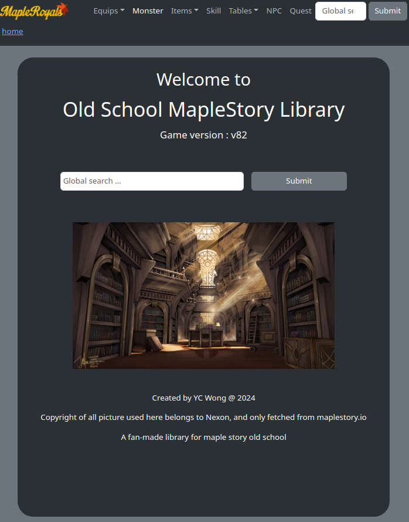

<!-- GETTING STARTED -->
# Maple Library
A fan-made library for maple story (old school). User can search item/mob/equip/skill/npc/quest by name, and sort the result by property they futher select.

## Features
- A fully-static site, accomplished by exporting all data into client. No backend server needed. 
- Client-sided routing built with react-router. 
- Fuzzy search is widely used. Sort algorithm is mostly custom made.

## Live DEMO : 
- https://library-maple-story.netlify.app/

## Tech Stack:
- React, React-Router, Bootstrap, Javascript

## Repo:
- https://github.com/WongYC-66/maple-library

### Installation
1. npm install
2. npm run dev
3. visit at http://localhost:5173
